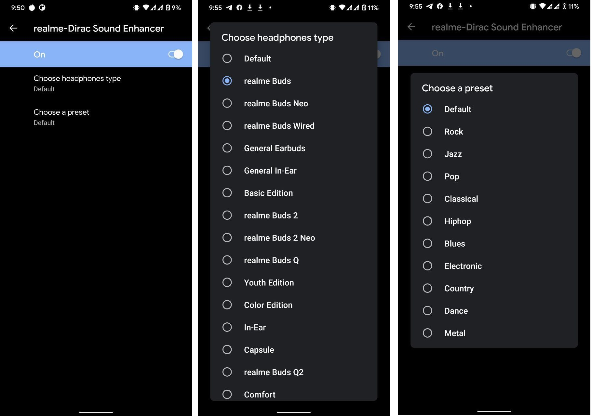

# RealmeDirac #
----------------------------------------------------
RealmeDirac is an open-source Android application written in java. RealmeDirac is a feature introduced by realme & dirac in realmeUI for sound optimisation, trying to recreate same thing, this is scratch written app aiming to provide same features as realmeDirac..

## Features ##
RealmeDirac offers various sound modes & features. You can grab a quick view of them in the Images below:

<p align="center">
  
</p>

<p align="center">
  
</p>

### Here is Complete list of features offered by realmeDirac ###
* Custom Sound Profiles
* Options to Choose headphone type
* QS Tile for Ease of Access


## Building RealmeDirac ##
* Clone this repository in `packages/apps/RealmeDirac` in your ROM's Sourcecode & Inherit realmeDirac Using these lines in your Device Makefile.
 
```
# RealmeDirac
$(call inherit-product, packages/apps/RealmeDirac/dirac.mk)
```

## Credits ##
* RealmeDirac is licensed and distributed under **The GNU General Public License v3.0**.
* This Project is Entirely Developed by 
  - [Aryan Sinha](https://github.com/techyminati)
* Also I would like to Thank,
  - SkullShady for Initial Dirac Implementation at Havoc-OS
  - HyperTeam for Realme Parts Implementation .

### Notes ###
* If your device uses Source Build vendor, following blobs & configs are necessary for basic functioning of realmeDirac
  - diracmobile.config
  - libDiracAPI_SHARED.so
  - libdirac.so
  - dirac effect defined in audio_effects.xml
* This Implementation is tested only in realme devices for now.
* In some cases UUID may differ, causing application to crash, adapt UUID for yourself or if you find a better way todo this, Open a Pull Request :D .
